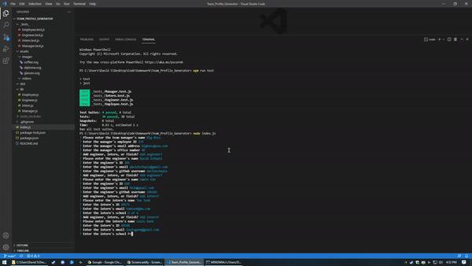
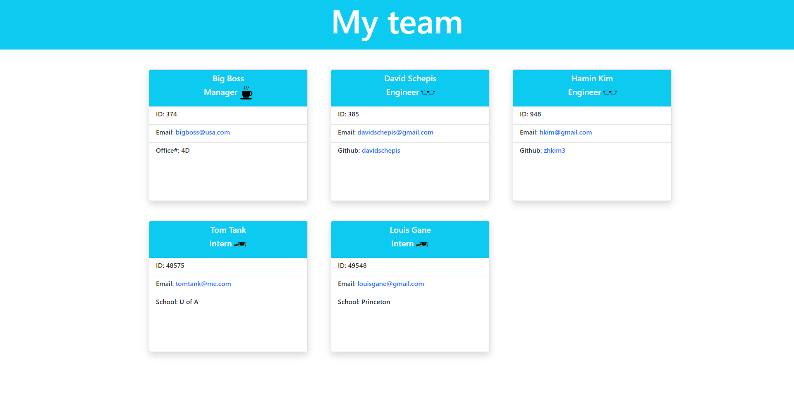
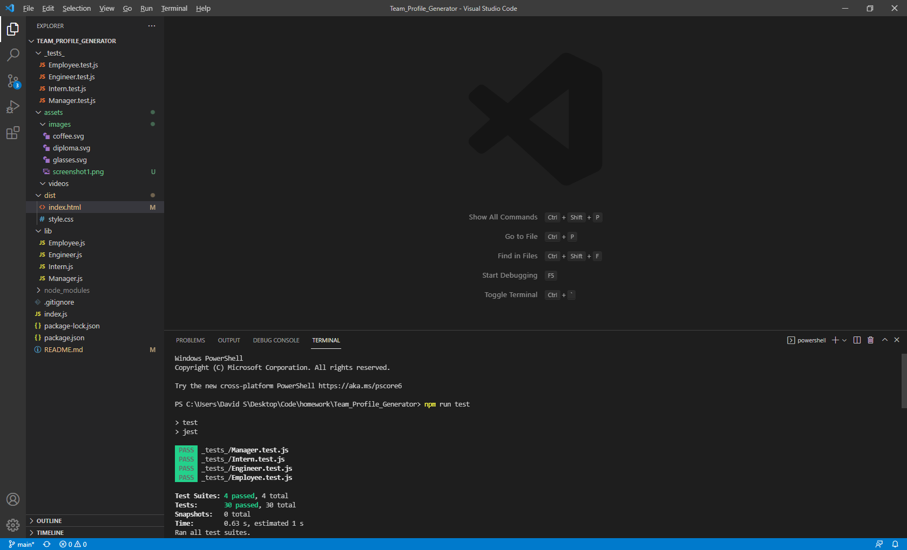
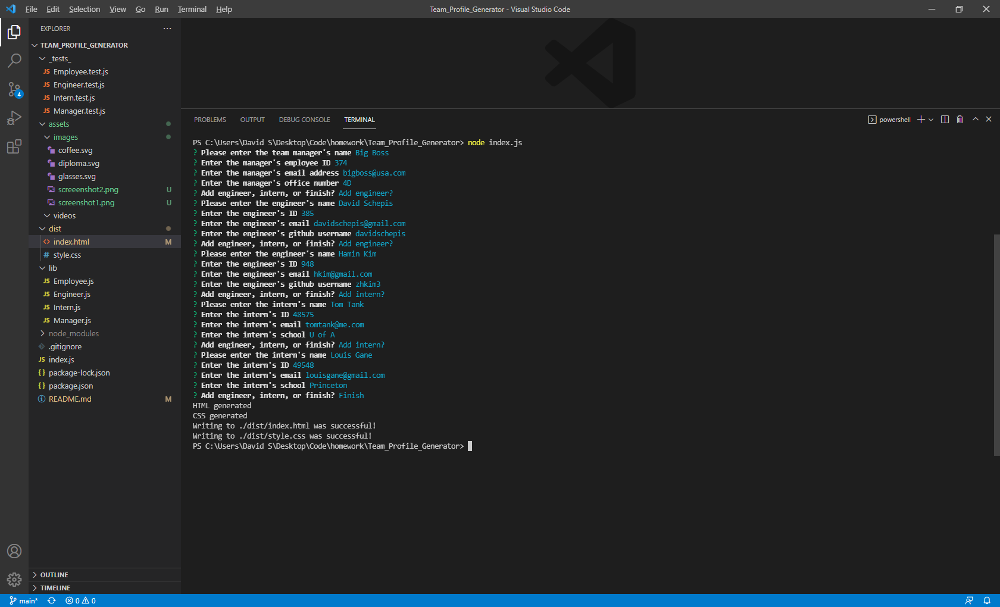

# Team_Profile_Generator


## Description
Creates a website showcasing a team of workers, with details provided by the user on the command line

## Table of Contents

- [Links](#links)
- [Example](#example)
- [Installation](#installation)
- [Usage](#usage)
- [License](#license)
- [Contributing](#contributing)
- [Tests](#tests)
- [Questions](#questions)

 ## Links
Github Repo: https://github.com/davidschepis/Team_Profile_Generator

Video: https://drive.google.com/file/d/1shN-PlQYjhwolVMfpMjhg_FjRb4dukT0/view

 ## Example

Gif Example



Screenshot1:



Screenshot2:



Screenshot3:



 ## Installation
To install necessary dependencies, run the following command:

```
npm install
```

 ## Usage
Allows an unlimited amount of engineers and interns, but only a single manager

 ## License
This project is not licensed

 ## Contributing
Please contact me if you wish to contribute

 ## Tests
To run tests, run the following command:

```
npm run test
```

 ## Questions
Please contact me at [davids.developer@outlook.com](mailto:davids.developer@outlook.com) with any questions.
Github Repo: [davidschepis](https://github.com/davidschepis).
